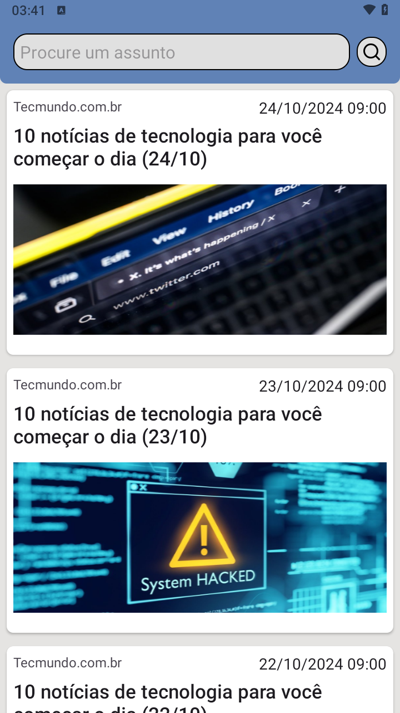

# News App

Aplicativo desenvolvido, de notícias utilizando a api [NewsApi](https://newsapi.org/) para adquirir os conhecimentos descritos nas ferramentas abaixo.

| Sem Busta de assunto           | Com busca de assunto                                  | video                                |
|-----------------------------|-----------------------------------------------------------|-----------------------------------------------------------|
|  |  |  |

Ultilizados:
* KOTLIN (linguagem de programação)
* XML (construção de layouts)
* MVVM (model view viewmodel)
* FRAGMENTS (lógica das telas)
* NAVIGATION COMPONENTS/SAFE-ARGS (navegação entre os fragmentos)
* PAGING 3 (busca paginada das notícias)
* FLOW (programação reativa)
* HILT (injeção de depêndecias)
* RETROFIT (requisições http)
* COIL (requisições das imagens)
* WEBVIEW (abrir as pagínas web dentro do aplicativo)
